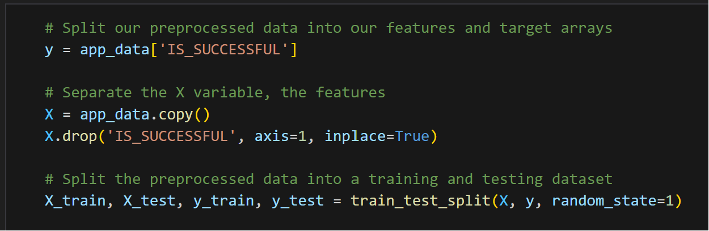
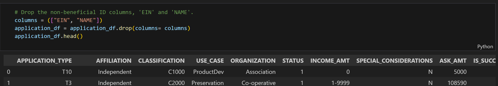
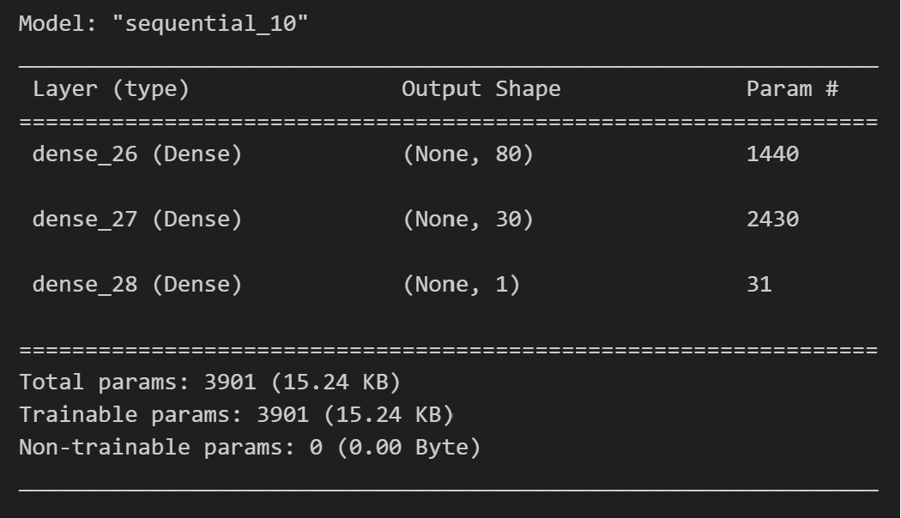
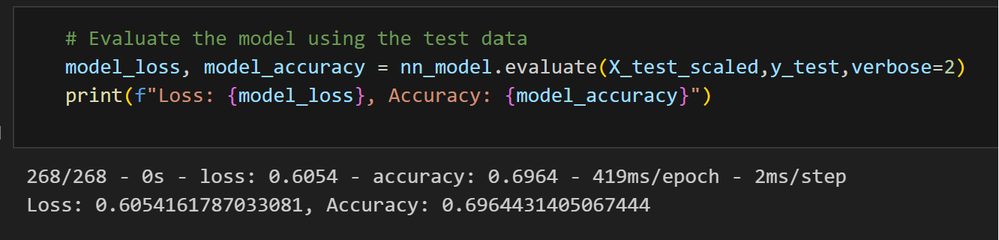
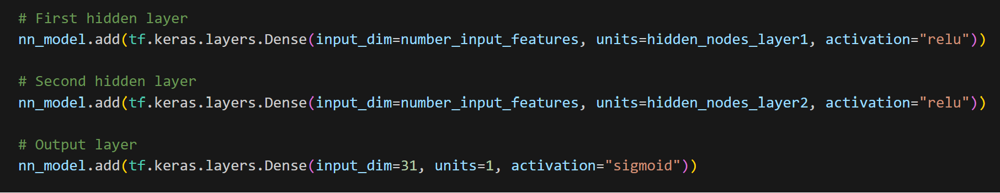

# deep-learning-challenge
# Neural Network Model Analysis
## Overview
Using a Neural Network to gain understanding of complex and imbalanced charity data.The Neural Network will help as this is a large dataset with several columns that make it harder to decipher trends and anomalies.
## Results

"*" Data Preprocessing
    1. Target value for this model "IS_SUCCESSFUL".

    
    2. Features of this model were "AFFILIATION", "USE_CASE", "ORGANIZATION", "SPECIAL_CONSIDERATIONS".

    
    3. Variables removed from this model were "EIN", "NAME", "APPLICATION_TYPE", "STATUS", "INCOME_AMT", "ASK_AMT"

"*" Compiling, Training, and Evaluating the Model
    1. Utilized one neuron, two layers, and three activation features. My understanding of this medium is not advanced, so I
    followed known examples used during classwork. My original model had static input values and that was causing an error. Found a model that uses the x_train_scaled value to base the input value off of.

    2. I was not able to acheive the desired target value of 75%. The last accuracy acheived was 69%.

    3. I updated the activation features between "relu", "tanh", and "sigmoid" for 10 total attempts.

"*" Summary
Thoughts of how the results could be optimized might be to balance the dataset or using a tool like the RandomOverSampler to choose a subset of values chosen at random. I would also consider using other values like, "INCOME_AMOUNT" and "ASK_AMOUNT". These values might best indicate success depending on the circumstances.
# References
IRS. Tax Exempt Organization Search Bulk Data Downloads. https://www.irs.gov/Links to an external site.